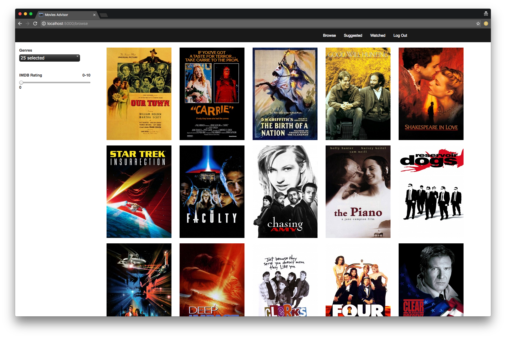

#### Custom Movies Advisor

Finding movies as per your individual taste has always been a hassle. Movie ratings and long reviews are your only ways to filter out movies.
Movie Advisor App deals with these problems for you and suggests you movies which are customized to you so that you spend time watching a movie, not in finding one.

**How it works**

 * User can filter movies based on genres and imdb ratings. Whenever an option is checked/unchecked from the dropdown menu, an ajax request is sent to the server, the relevant movies are queried from the postgres database, their thumbnails are sent back as response to the page and they get updated in place. 
 * When you click on a thumbnail, details about the movie are displayed such as title, plot, release year, genres, the source links where you can watch the movie.
 * User can keep track of movies that he/she has seen by marking them as seen.
 * In order to give personalized recommendations, the app gets feedback from the user in the form of multiple choice questions whenever a movie is marked as seen.
 * The app basically classifies movies into genres that the users think the movie falls into. It then uses this information along with user's taste to give recommendations. 
 * The app groups movies using k means clustering algorithm and then suggests movies from the cluster which has the user's most liked genre rated highest for a movie.

### Technology Stack

 ** Application:** Python, Flask, Jinja, PostgreSQL, SQLAlchemy, k means clustering algorithm, scikit-learn, bcrypt
 **APIs: GuideBox, OMDb
 **Front-End:** AJAX,Javascript, JQuery, Bootstrap, HTML/CSS, JQuery multiselect widget

